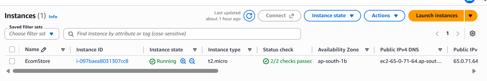
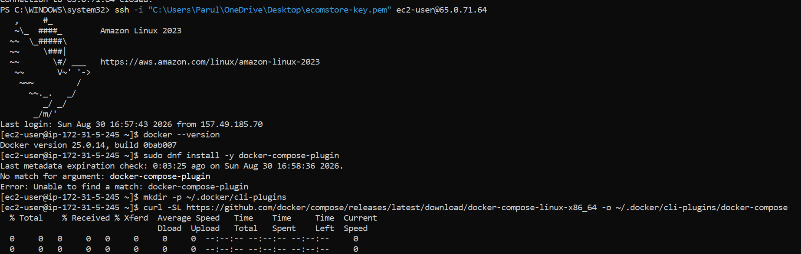
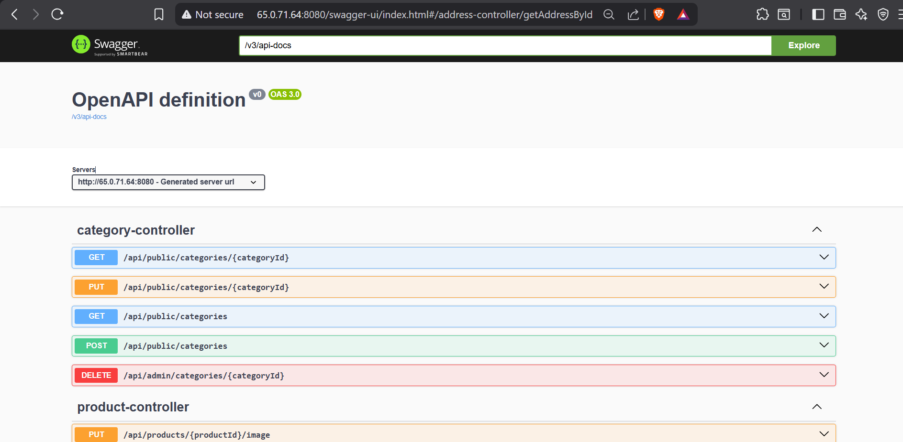

# 🚀 EcomStore — AWS Deployment Proof

This document contains evidence of the EcomStore Spring Boot application being deployed and running on AWS.

---

## ☁️ AWS Infrastructure

### EC2 Instance

The Spring Boot application is deployed on an Amazon EC2 instance running Amazon Linux 2023.

<p align="center">
  
</p>

### RDS Instance

PostgreSQL is hosted on Amazon RDS in the AWS `ap-south-1` (Mumbai) region.

<p align="center">
  
</p>

---

## 🔐 EC2 Connection

SSH access to the Amazon Linux EC2 instance was successfully established.

<p align="center">
  
</p>

---

## 🌐 Deployed API

The deployed Spring Boot application is accessible through the EC2 public IP address.

Swagger UI is available for testing the deployed REST APIs.

<p align="center">
  
</p>

### API Request Verification

A REST API request was successfully sent to the deployed application using Postman.

<p align="center">
  
</p>

---

## 🐳 Docker Deployment

Docker is used to containerize the application infrastructure.

Docker Compose manages the containers running on the EC2 instance.

```bash
docker compose -f docker-compose.aws.yml up --build -d
